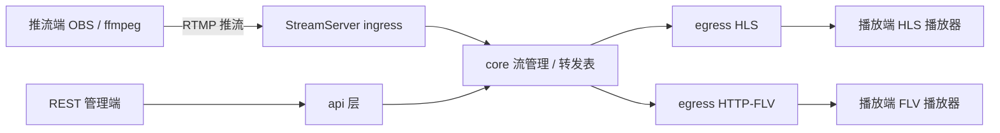

# 架构文档（ARCHITECTURE）

- 适用范围：StreamServer 全部代码
- 状态：Live document —— 随实现演进，行为或模块有重大变更时必须更新本文档并登记 ADR
- 必读顺序：README → 本文档 → CONTRIBUTING

## 1. 设计目标

| 目标 | 说明 |
| --- | --- |
| 简单可演进 | v1 覆盖经典直播链路，模块边界清晰，后续协议可插拔扩展 |
| 业务与协议解耦 | 协议层（RTMP / HLS / FLV）不感知业务逻辑；业务层通过核心抽象（流、事件）工作 |
| 可测试 | 核心逻辑不依赖具体传输实现，可独立单测 |
| 可观测 | 结构化日志、健康检查、关键事件可追踪 |

## 2. 系统上下文



## 3. 技术选型与默认决策（ADR 摘要）

| # | 决策 | 状态 | 理由 |
| --- | --- | --- | --- |
| ADR-001 | 基于 Node-Media-Server 封装媒体核心（仅 RTMP + HTTP-FLV + 静态伺服），不自研协议解析 | 采纳 | 成熟、维护活跃；把精力放在业务层（鉴权、录制、编排）。**M2 实测发现 v4 已移除 HLS/trans**，原方案中"NMS 提供 HLS"的部分由 ADR-006 替代 |
| ADR-002 | TypeScript 严格模式 + NodeNext 模块 | 采纳 | 类型安全；ESM 为主（M2 已落地，NMS 为 CJS 经 esModuleInterop 互操作） |
| ADR-003 | 配置 = 环境变量 + `config/` 文件，启动时 schema 校验 | 采纳 | 部署友好，避免魔法值（M1/M2 落地：fail-fast + 生产强制 AUTH_SECRET + 路径穿越校验） |
| ADR-004 | 业务层通过事件 / 抽象依赖媒体核心，禁止反向依赖 | 采纳 | 可测试、可替换实现（架构守护测试固化） |
| ADR-005 | 单进程 + 内存转发表，v1 不做多节点 | 采纳 | 满足 v1 规模，避免过早分布式（MemoryStreamRegistry 落地） |
| ADR-006 | HLS 由 egress 层实现：每路活跃流 spawn 一个 ffmpeg（RTMP 拉 → HLS 切片），经 NMS 静态路由伺服 | 采纳 | NMS v4 无内置 HLS；自建 egress 更贴合架构分层。代价：依赖外部 ffmpeg、关键帧间隔决定切片延迟；含就绪重试与宽限期清理 |

> ADR 状态流转：提议 → 采纳 → 已替换。新决策按 §9 模板登记，先评审后采纳。

## 4. 模块划分与依赖方向

```
api ──► core ◄── ingress ──► auth
              ▲
              │
        egress ┘
   （ingress / egress / api 均依赖 core 的抽象，不得反向）
```

- `ingress`：监听 RTMP 端口，接收推流；在接入点调用 `auth` 鉴权钩子；把媒体流转交 `core`。
- `core`：流注册表（StreamRegistry）、发布 / 订阅生命周期、事件总线。**不依赖任何传输实现**。
- `egress`：消费 `core` 的流，产出 HLS 切片 / HTTP-FLV 响应。
- `api`：REST 管理接口（查询在线流、踢流等），只走 `core` 公开接口。
- `auth`：推流 / 拉流鉴权，策略可插拔（v1：URL 签名）。
- `lib`：日志、错误码、通用工具。任何模块可依赖。

依赖规则（强制，违反即 Review 不过）：

1. 只允许上层依赖下层抽象；`core` 不得 import `ingress / egress / api` 任何实现。
2. `ingress` 与 `egress` 之间的协议互转一律经由 `core`，禁止互相直接引用。
3. 第三方库只在适配层（ingress / egress）内使用，不泄漏到 `core`。

## 5. 数据流（推流 → 拉流）

1. 推流端 RTMP 连入 `ingress` → `auth` 校验签名 → 拒绝则断开。
2. 通过后，`ingress` 在 `core` 注册流（streamKey 全局唯一），开始接收音视频包。
3. `egress` 订阅该流：HLS 侧按分片策略生成 `.ts` 与 `m3u8`；HTTP-FLV 侧维护订阅者连接。
4. 推流断开 → `core` 触发 `onStreamClose` → `egress` 清理分片与订阅者。

## 6. 配置与安全基线

- 配置项集中在 `config/`，通过环境变量覆盖；启动时用 schema 校验，非法配置直接 fail-fast。
- 默认端口：RTMP `1935`；HTTP（拉流 + 管理）`8000`。
- 安全：推流必鉴权；管理 API 与拉流端口分离（v1 可配置）；日志脱敏（不打印签名密钥）。
- 依赖安全：`npm audit` 纳入 CI；`package-lock.json` 必须提交。

## 7. 测试策略

| 层 | 手段 |
| --- | --- |
| 单元 | Vitest：`core` 注册表 / 事件、`auth` 校验、HLS 分片命名等纯逻辑 |
| 集成 | 起真实服务：ffmpeg 推流 → 断言 m3u8 / FLV 可拉（CI 含 ffmpeg 时） |
| 契约 | 管理 API 请求 / 响应 schema 测试 |

## 8. 非目标（v1 明确不做）

- WebRTC / SFU、转码、DRM、多节点 / 水平扩展、持久化元数据库、P2P。
- 出现上述需求时：先登记 ADR 再动架构，禁止绕过本文档直接加模块。

## 9. ADR 登记模板

```markdown
# ADR-NNN：<标题>
- 状态：提议 | 采纳 | 已替换
- 日期：YYYY-MM-DD
- 背景：……
- 决策：……
- 后果：收益 / 代价
- 备选：……
```

## 10. 演进路线

M1 骨架 → M2 RTMP + HLS → M3 FLV + 鉴权 → M4 录制 + 管理 API + 观测。每个里程碑完成需满足 [CONTRIBUTING.md](./CONTRIBUTING.md#8-dod完成定义) 中的 DoD。
